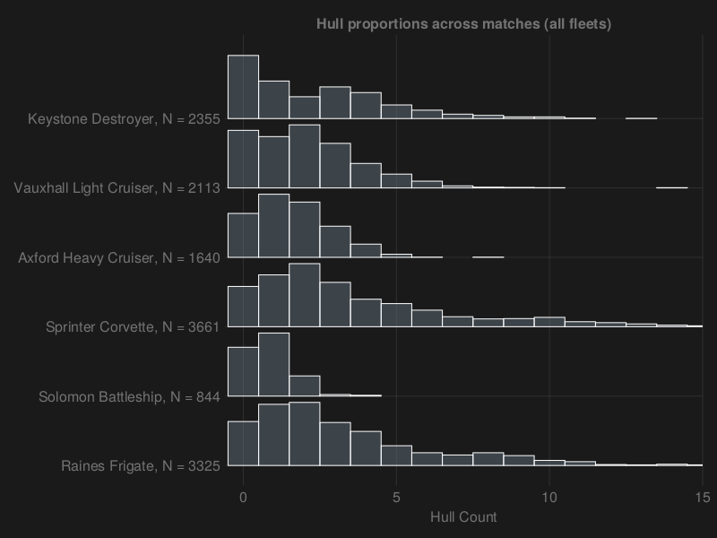

# What does the average Neb game look like?

To begin, Lets take a look at the breakdown of fleets in neb:
This is across all battles (that I have). Lets take a look and make some thoughts! 

## ANS Hulls 

| Hull                   | mean               | median |
| ---------------------- | ------------------ | ------ |
| Sprinter Corvette      | 3.58 | 3.0    |
| Raines Frigate         | 3.25 | 2.0    |
| Keystone Destroyer     | 2.30 | 2.0    |
| Vauxhall Light Cruiser | 2.07 | 2.0    |
| Axford Heavy Cruiser   | 1.60 | 1.0    |
| Solomon Battleship     | 0.82 | 1.0    |

## OSP Hulls

| Hull                   | mean               | median |
| ---------------------- | ------------------ | ------ |
| Shuttle                | 3.93 | 3.0    |
| Tugboat                | 3.52 | 2.0    |
| Bulk Feeder            | 3.11 | 3.0    |
| Bulk Hauler            | 2.97 | 3.0    |
| Ocello Cruiser         | 2.12 | 2.0    |
| Container Hauler       | 0.41 | 0.0    |

As we can see, there seems to be a good mix of capital ships and suporting ships, which would be as the developers intended. A few insights on this.

* Sprinters and Raines are very common though I was suprised that sprinters were higher, given the versitility of the raines mount, and seeing more raines swarms than sprinter swarms
* Keystones are more prevelant than Vauxhalls. People like beams I guess. 
* Axfords were lower and Solomons were higher. Don't see thaaat many Solomons in multiplayer, so this was suprising.

* OSP smaller ships are cheap, so its not suprising to see lots.
* Looots of haulers.
* Containers are less than common. I've seen them a lot, so this was suprising. 

## Hull Density

Looking at the distribution of the hulls in a fleet, we can view this with a density estimate:

Yea Nice. Hey so this is a good start! 
