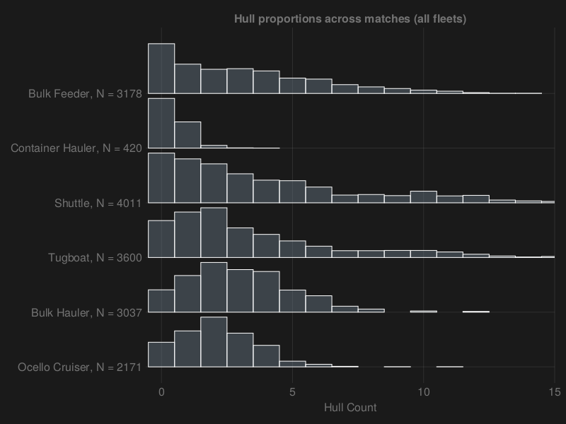
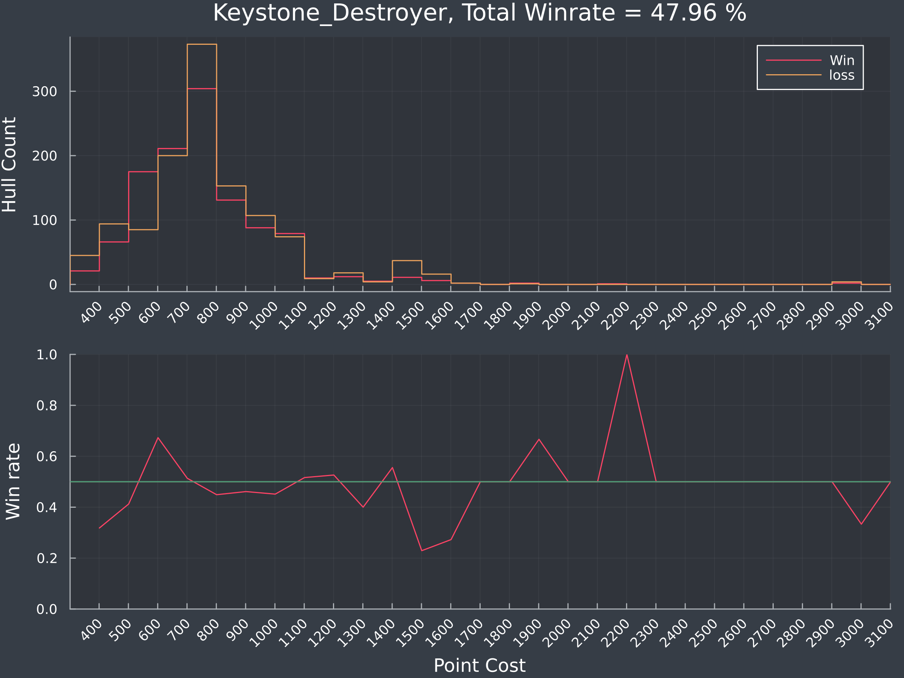

# What does the average Neb game look like?

I've recently spent a bit of work parsing the data from a vast amount of battle reports, and the things I could do with this data was quite overwelming. So Ive decided to start small. 

I want to know what an average game of Neb looks like in a few spaces. While I could look at things like, average game time, I'm not too interested in that minutia. I decided to start with fleet composition across all players, and the win rates between OSP and ANS.   
Lets get to it!

## Fleet Composition 
### ANS Hulls 

| Hull                   | mean               | median |
| ---------------------- | ------------------ | ------ |
| Sprinter Corvette      | 3.58 | 3.0    |
| Raines Frigate         | 3.25 | 2.0    |
| Keystone Destroyer     | 2.30 | 2.0    |
| Vauxhall Light Cruiser | 2.07 | 2.0    |
| Axford Heavy Cruiser   | 1.60 | 1.0    |
| Solomon Battleship     | 0.82 | 1.0    |

### OSP Hulls

| Hull                   | mean               | median |
| ---------------------- | ------------------ | ------ |
| Shuttle                | 3.93 | 3.0    |
| Tugboat                | 3.52 | 2.0    |
| Bulk Feeder            | 3.11 | 3.0    |
| Bulk Hauler            | 2.97 | 3.0    |
| Ocello Cruiser         | 2.12 | 2.0    |
| Container Hauler       | 0.41 | 0.0    |

As we can see, there seems to be a good mix of capital ships and suporting ships, which would be as the developers intended. A few musings on this.

* Sprinters and Raines are very common, though I was suprised that sprinters were higher given the versitility of the raines mount and seeing more raines swarms than sprinter swarms
* Keystones are more prevelant than Vauxhalls. People like beams I guess. 
* Axfords were lower and Solomons were higher. Don't see thaaat many Solomons in multiplayer, so this was suprising.

* OSP smaller ships are cheap, so its not suprising to see lots.
* Looots of haulers.
* Containers are less than common. I've seen them a lot, so this was suprising. 

So if we were to pick a random game, it wouldn't be too far fetched to think that it could look something like this:

ANS would have a Solomon, an Axford, two Vauxhalls, two Keystones, two Raines, and three Sprinters. 

OSP would have two Ocellos, three Lineships/Bulk Haulers, three Feeders/Monitors, two Tugs and three Shuttles. 

One of my projects as a part of this, is to build a neural network that can predict the outcome of the battle based off the hulls provided. Ideally this would take into account how different roles might complement each other, while 4 container launchers may not be viable. 

I would like to see what the likely outcome of the average fleets would be.  

### Hull Density

Looking at the distribution of the hulls in a fleet, we can view this with a density estimate

*We could use a histogram for this, but I think the density looks better as it is continuous (even though it goes below zero)*

I don't really have too many thoughts on these. This chart is more descriptive than insightful. You can see which hulls are used in swarms. Because I'm looking at a match perspective, you also see where they are not used, ie when there are zero. 

*this chart initally confused me because I thought that games with 3 Solomons were somewhat common* 

## Win Rate

Finally, the win rate of these two fations:

| Faction                   | Wins               | Win PCt |
| ---------------------- | ------------------ | ------ |
| ANS                | 482 | 0.4725   |
| OSP                | 538 | 0.5274    |

Doing a Chi Squared test, which for non stats people evaluates the likelihood that the the factions are balanced (aka the win rate should be exactly or close to 50:50), the p value is 0.0795

Convention would be to reject the p value if it is under 0.05, or 5%. We're above this, but not by much. More battle reports would help to see if this where true.

While there is a slight lean towards OSP, I think the primary reason is that most newer players start with ANS as the tutorial is ANS focused, so that could lead to the reason why ANS is slightly lower. By the time players get to OSP, they are comfortable with jamming, scouting and so on and don't bring lose the game in the fleet editor.

On that, there seems to be a common theme amongst new players to put all the points in a fancy battleship. This is much easier to do as ANS with the Solomon hull, while there isn't the same type of build equivilent (I don't think) as OSP. Putting 3000 points into an Ocello or a Line ship is quite hard, and I've often seen a brave but foolhardy ANS player charge their battleship into the center of pillars with no support and lose it to missiles. 

*Note that this is my perspective from my experience and ~320 hours. Yours might be different. I would love to hear it!*

## To Conclude

While this post isn't the most meaning or interesting as I would like it to be, I've taken a look at what the average game of Neb looks like. I've also set up all the stuff around putting this up on the web, parsed the data and played a bit of Nebulous, and I wanted something to show for it.

I've got no huge takeaway from hul Composition, but I think seeing that there doesn't seem to be a huge statistical difference between OSP and ANS. If there is I think it is the result of newer players more likely to enter multiplayer via ANS.  

## Whats next

I've got what I think is jucier, and more interesting to the average Neb Player coming soon, but its a bit unpolished and I really wanted to get something out there. 

In the meantime, here is a chart showing the Win/Loss ratio of the Keystone hull, compared to its point cost. I'm doing an analysis of how many points you should put into a hull and (hopefully) why:

