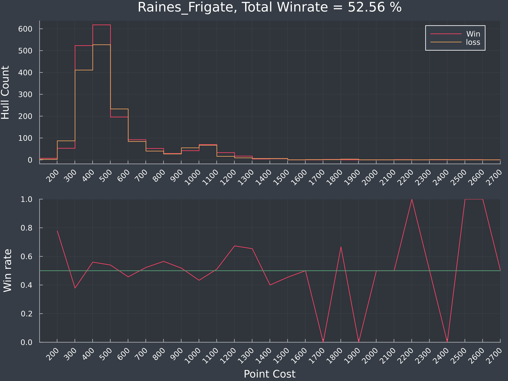
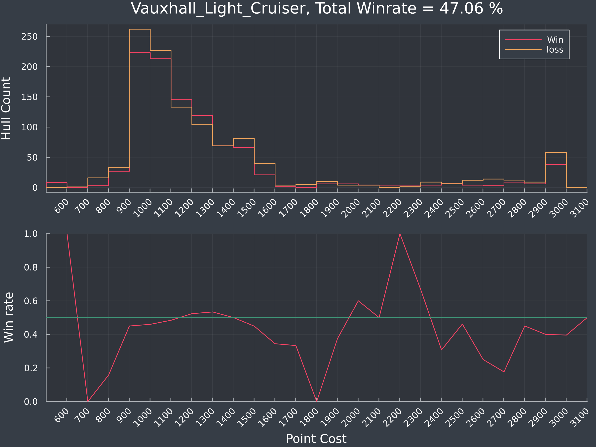
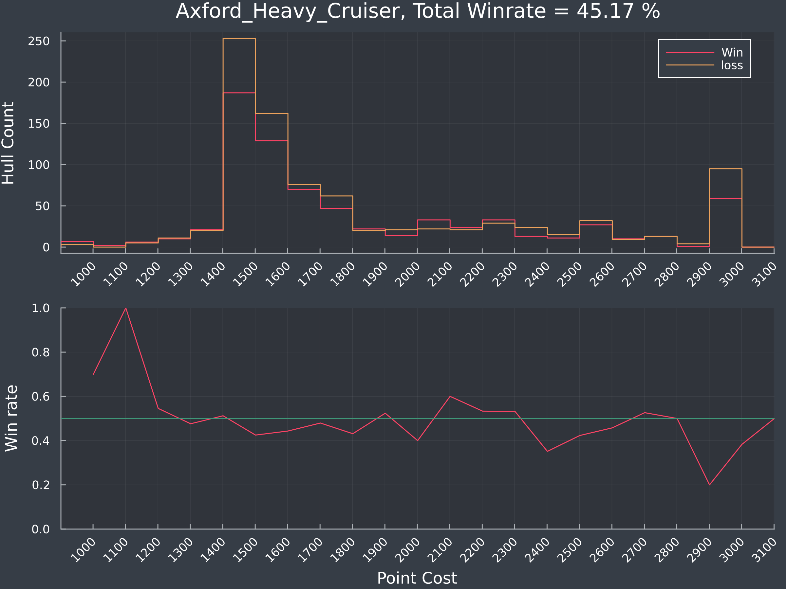
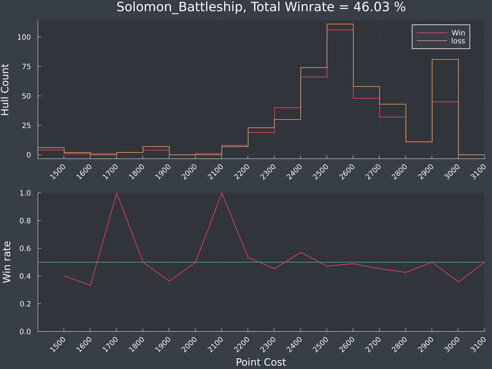

# Do points matter - ANS

"The point distributon of a hull effect the likelihood of the hull participating in a wining team"

While I don't think anyone would disagree with this on the face value, as you need to spend points to buy guns/missiles/etc to shoot ships, I did wonder if there were optimal amounts of points to spend on a hull. 

For example, if I seriously kit out two gun Vauxhalls, is this more effective than have three less kitted Vaux's, or two Vaux's and several escorts?  
Is there a point where we can see in the data that spending too much, and putting too many eggs in one basket is more likely to be detrimental? 

Now a bit of a note on this and the conclusions I'm going to make here. This isn't to say that your build is bad because you're spending too much points on a Vauxhall. The great thing about Nebulous is that the meta is still growing and developing, and none of the hulls exhibit a huge win loss difference (except one), meaning that people also can win with hulls that cost that much. It just happens less, which makes it less **viable**. 

While points are a somewhat crude measure, as they don't take into account the difference between missiles and guns and lasers, there did seem to be some insight that you can take away from them.  
Anyway, without further ado, lets get to it!

### Quick word on how to read these charts:

For each Hull, there are two charts. The top is a histogram of the win/loss by point value. I've done this for every hull I have stats on, so there are naturally higher values for smaller ships. 

Then there is measure I have tried to derive from the top chart of point viability. This is a normalised (between -1 to 1) measure of how viable a hull is at for each band of cost. Positive values are mean the hull is more viable, while negative values mean the hull is less viable. These values are scaled by the win rate and the size of the sample to prevent outliers were there are 3 wins and no losses from dominating the chart. 

Becasue they are normalised to the hull, you shouldn't compare these across hulls. This is designed to be a measure of how viable each hull is in the unknown soup of whatever else is brought to the battlefield. 

Finally, in the header, there is a winrate. I'm unsure if I should keep this in, as it is biased against the win rate with a slight tilt to OSP. I'm also unsure if it applies equally to smaller ships and bigger ships. Swarms that win games will push it up more than single ships that are equally effective. I've put it in for now, but I have mixed feelings and may take it out if I feel its misleading.  

### Point viability formula
The formula I've used to calculate point viability is described below

```Julia
#For each point band of 100 points

# Get the Win/Loss weights from the histogram
# These are the values we see in the top chart

winH = fit(Histogram, w.pointCost, start:step:finish).weights
lossH = fit(Histogram, l.pointCost, start:step:finish).weights

# Get the difference between wins and losses
# Multiply it by the sum of the sqrt of the W/L rates, and sqrt it again  
# the second sqrt meant the count of ships in larger buckets dominated 

rate = (winH .- lossH ) .* sqrt.(sqrt.(winH) .+ sqrt.(lossH) )

# And normalise it to -1 and 1 by finding the max extreme value. 
# We still want to keep the default at zero, so not a min/max normalization

rateN = rate ./ max(maximum(rate),abs(minimum(rate)))

```

I hope this makes some sense! I've got no mathematical  justification for why I chose the transformation I did, except it seems to look reasonable useful. 

# ANS Hulls

## Sprinter Corvette


### Thoughts and musings
Sprinters seem to be very effective hulls. Most prominent in the 200-400 point bands, they excel as support ships, PD escorts, spotters and jamboats. I suspect they have such a high win rate because they are very effective support ships. The more scouts you have, the more you can plan and premept your oppositions actions. 

Also sprinter swarms can get very close to you undetected, ( I'm not a radar expert but I think about ~4k before you can detect them ), can all mount a 250 cannon, a jammer/bullseye with ample PD on the side mounts. I don't think there are any fleets that wouldn't be made better by adding an additional sprinter into the mix.  

I'm unsure of how viable the Sprinter is for missiles from this, but it seems like the sweet spot for a Sprinter is between 200-400 pts. While you can go higher, it appears that the viability diminishes. Why have a single 600 pt Sprinter when you could have twice the scouting power with 2x 300 pt Sprinters?

## Raines Frigate



### Thoughts and musings

While the Raines frigate seems to operate in a similar space as the Sprinter, it seems like you do have to put some points into a Raines for it to become viable. Raines under 300 points are not as effective as they are over 300 points but this extra investment seems well woth it. Over 500 points they seem to become less viable, though not by a huge amount. 


I suspect this is where the 4x Jammers/Sarissa builds come in, and they become quite costly to get the power requirements for the 4th item.

while I'm pretty sure that sweet spot for jammers is 4(?) I don't know if putting them all on a Raines is the most effective use of points.

Personally I often run a Raines swarm and with about 380 points each, I get 14x250mm cannons, Jamming, radar and ok PD, and find that the volume of ships is often what makes it effective.   
Cheaper hulls = More ships = More firepower


There also seems to be a spike of Raines at the 1000+ pt space, which is missile builds. They seem to be equally viable, with investments up to 1200 points also viable. A fleet in this space might be 2 Raines, each with a missile programming bus array to get to 4 missiles, which with 2 Raines allows you to have plently volleys of 8 SH2 volleys which can take down solo ships. the extra 800 pts allows you to bring other utility functions, with a scout or two on top.

While there certainly may be other build, this is an example that I have seen work, and the data would say seems unviable. 

## Keystone Destroyer


### Thoughts and musings

Now this is an interesting one! Keystones seem to really shine in the 500-700 range, but above this their viability seems to really fall off. There does see to be a slight bump up just at the 1000 pts mark, but adding more points seems to drop off again. I think my take on this is that the more beams or rails you have, generally the better.

This is a case where I would like to break up the hulls into two based on the spinal mount, to then see if there are any functional differences between the two. 

I don't have too many more thoughts on this, other than if you have a DD over 700 points, do you think your feet would be better if you had 2? 

## Vauxhall Light Cruiser



### Thoughts and musings

Now the Vauxhall is an interesting hull, and possibly one of the hardest hulls for a beginner to play. If running three of them, similar to TF Birch, you need to have a good knowledge of the opposition hulls, as you need to know what fights you can take, and what fights you need to run away from. If you do the latter badly, you can get pounded into dust. 

Personally while I do quite like Birch, I find it very hard to get a good mix of jamming, locks, PD and firepower in 3 x 1000 pt Vauxhalls. While maybe I'm bad, it seems like the data backs this up. 

Vauxhalls above this seem to perform better, likely with either a missile backpack and/or support ships. This seems to stop at 1500 pts, likely because the lack of scouts. I'm assuming that most ships in this space operate as a pair. 

Finally there are the 3000 point missile cruisers. While they do have success, they still don't seem super viable. Again, and I'm feeling like a bit of a stuck record here, I think this is due to the lack of support ships. If you bring one of these, you are either entirely dependant on your team for scouting missile targets or you're putting your entire fleet at risk to get targets yourself. 

*This isn't to say you shouldn't bring this build. It does work, but it loses more games than it wins. The reasons as to why are most likely numerous, and I can't really say why a hull wins or loses, especially at just the hull cost.*


## Axford Heavy Cruiser



### Thoughts and musings

This was suprising to me, as I thought the Axford was one of the more sucessful hulls, espcially at the 1500 level. I personally have several fleets with axfords and feel like I have more success with them than what I am seeing here. Still the numbers don't lie, and I'm left to wonder why. 

Axefords become marginally more viable at the 2000 point mark, and I suspect if this is the Hemlock stlye builds coming out, or anything with a competent missile backpack + gun/beams

Beyond that, the Axford missile boat at 3000 pts is less viable and I think for the same reasons as the 3000 pt Vaux. You're very relaint on your team for scouting. 

## Solomon Battleship



### Thoughts and musings

The Solomon is an interesting Hull. I've seen it be devestatingly effective, as well as being an absolute noob trap. While there are no glaring sweet spots, there seem to be a viable build at 2300 pts. I think this could be the optimal sweet spot for a solomon, as it gives you plenty of points for escorts.

Unsuprisingly (to me at least), the 3000 pt solomon is the least viable. I think this comes down to this being **the** noob trap, and from a mechanics perspective, no escorts, combined with the largest radar signature makes this build an absolute target.

Like the Keystone, doing a seperate comparison on beams vs guns would be interesting, and might be something for a future post. 

Personally I don't mind a good Overwatch Solomon, though I play them much less than I have previously. Escorts are a must, else you're very vulnerable. I think the biggest takeaway is that you can put too many points into it, and these points don't translate well into making the solomon any more effective.


## Conclusions

Getting the right amount of points into a hull is hard. This post should be used as a guide, not as a rule, as there are many other factors beyond hull cost that go into winning a game. Building fleets to fit inside the numbers that I'm seeing here shouldn't be the aim, as things like team coordination, abilitiy and fleet synergy matter far more. Winning games in Nebulous is a complicated business, and sometimes you just get stomped because of the risks you take. 

This post also fails at saying what are the best parts for the build, but unfortunately this isn't really in the battle report. 

However, on this, I think I do have some takeaways:

* You can definately overbuild your fleets. Specially for Hulls like the Raines, the Keystone and the Solomon, more points don't often make the hull much more effective. 
* Support ships are very effective. I think one of the more underatted parts of Neb is intelligence/vision. Maybe that comes under Ewar, but being able to keep eyes on more of the map allows you to make more informed tactical decisions. In this sense, support ships are a force multiplier for your team. For example, your intelligence might show 3 fleets on one side of the map, which allows 2 of your team mates to push D, and steamrolling the single fleet that tried to hold that side. In the battlespace, the intelligence you gained by having an extra Sprinter or shuttle was more effective than having a super accurate solomon. 

* Single ship missile fleets seem underwelming? these fleet generally seem to consistently lose more than they win. I don't know why this might be the case, but it seemed to be a common theme across Vauxhalls and Axfords. 

* The 3000 point Solomon seems like an objectively bad build that will lose aboout 65% of the time. 

## Whats next

I'm going to do OSP next, but It might be a touch longer. I've also got a rudimentry neural network to predict the outcome of a battle based on the hulls on either side. The only thing is, I need about 10x more battle reports that I currently have to feel confident in it. More would be appreciated! 


