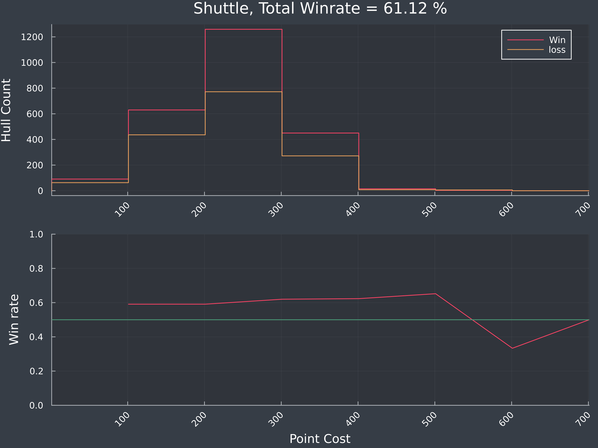
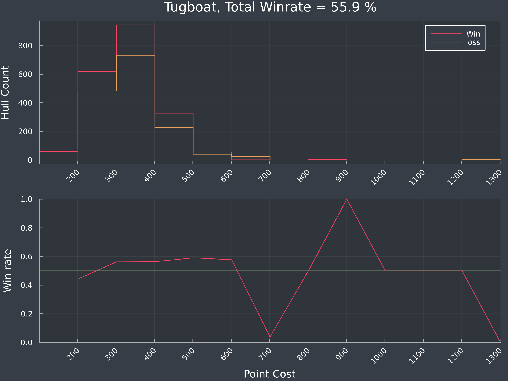
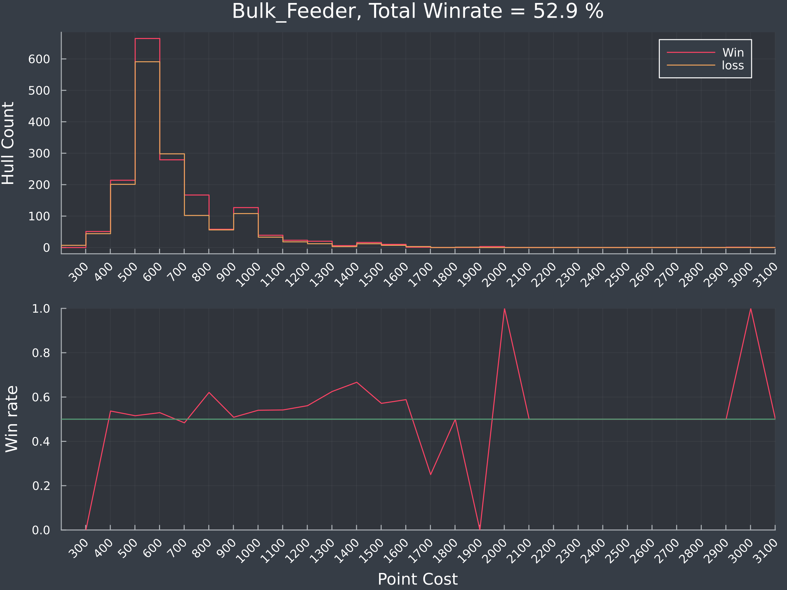
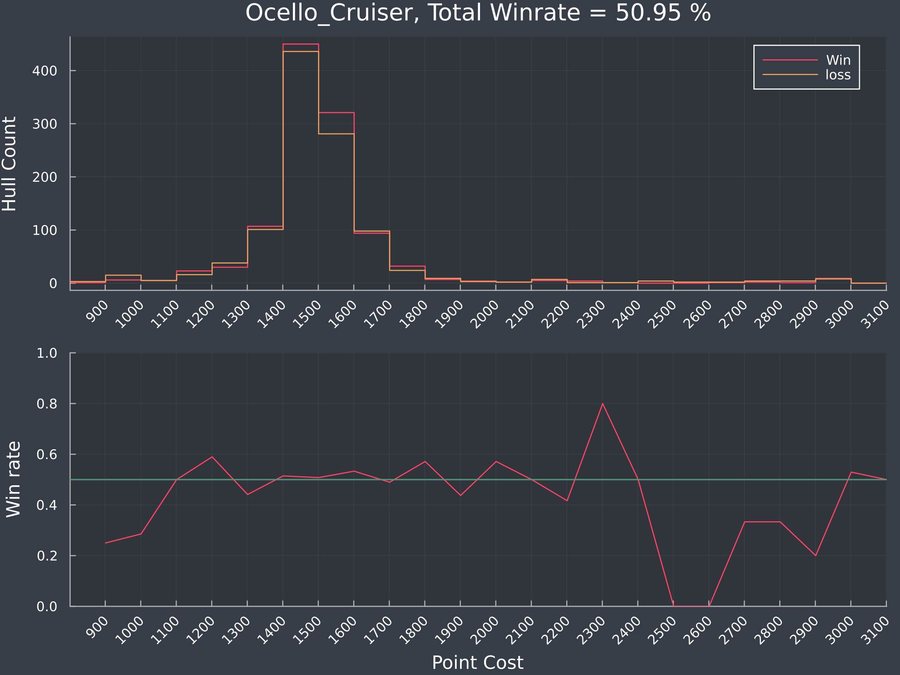
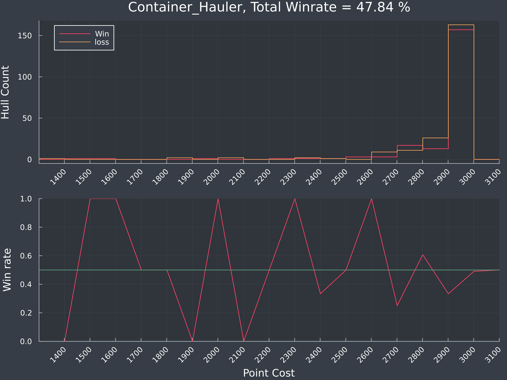

# Do points matter - OSP

"The point distributon of a hull effect the likelihood of the hull participating in a wining team"

While I don't think anyone would disagree with this on the face value, as you need to spend points to buy guns/missiles/etc to shoot ships, I did wonder if there were optimal amounts of points to spend on a hull. 

For example, if I seriously kit out two gun Vauxhalls, is this more effective than have three less kitted Vaux's, or two Vaux's and several escorts?  
Is there a point where we can see in the data that spending too much, and putting too many eggs in one basket is more likely to be detrimental? 

Now a bit of a note on this and the conclusions I'm going to make here. This isn't to say that your build is bad because you're spending too much points on a Vauxhall. The great thing about Nebulous is that the meta is still growing and developing, and none of the hulls exhibit a huge win loss difference (except one), meaning that people also can win with hulls that cost that much. It just happens less, which makes it less **viable**.

While points are a somewhat crude measure, as they don't take into account the difference between missiles and guns and lasers, there did seem to be some insight that you can take away from them.  

My only hope and takeaway would be that if you have a build that consistenly loses, and it loses more than it wins, then, then maybe reconsider that build.

Anyway, without further ado, lets get to it!

### Quick word on how to read these charts:

For each Hull, there are two charts. The top is a histogram of the win/loss by point value. I've done this for every hull I have stats on, so there are naturally higher values for smaller ships. 

Then there is the winrate at each 100 point range. Note that this will be skewed by smaller values, so for small values of the chart above, I would take with a grain of salt. 

Finally, in the header, there is the total winrate. This is the number of wins / number of games this hull has been in. 

# OSP Hulls

## Shuttles

### Thoughts and musings

Shuttles are a very effective hull, and have a high win rate. Good for many roles. This chart would suggest that points put into sprinters are generlly pretty well spent.

## Tugboat

### Thoughts and musings

Tugs have a pretty similar role to Sprinters, though slower but with slightly more mounts. They shine in the 200-300 pt range. Tug swarms are a tough nut to crack, and the bloodhound + early warning radar tug builds are pretty effective at getting good intel. Tugs fit into a lot of strong OSP builds, so I'm not suprised that they are well represented. 

## Bulk Feeder / Monitor

### Thoughts and musings

These ships work well as swarms, and shine at the 500 pt spit, as well as the 700 pt. I think the 700-1000 point is the S2 Spam, and I also suspect that the 700 point is more effective than the 1000 pt,  is becasue 4 ships that spew out missiles has better pen than 3 or 2. 

Beyond that, the Monitor doesn't seem to have any other strong points, but also doesn't seem to have any builds where it performs badly (based off point cost) 

## Ocello Cruiser

### Thoughts and musings

Ocellos are a very common ship and are often taken by newer OSP players as they are most familar to ANS. Being able to access ANS stuff is appealling and often Ocellos are full of Sarissas and Auroas. Ocellos often feel like a jack of all trades, and to get the most out of your 'cello though, you gotta dump at least half your points into one to specialise. Dual Ocellos are a common fleet build and generally do ok, if built and handled well.

## Bulk Hauler / Line Ships

### Thoughts and musings

Hulk haulers are probably the most intereting and OSP-like ship. There are a variety of ways to build these ships, but the most effective point range seems to be in the 700 - 1200 range. Again for most of the same reasons you don't want to stack all your points in one fleet for ANS. You need scouts to make the points you've stacked in the big ships work. 

While I suspect that the less performative point range of 1300+ is because of the lack of scouts, its hard to make any conclusive comments about builds, as there are many liner builds. 

Other than the 3k missile liner builds, which while ok, win slightly less games than they lose.

## Container Hauler

### Thoughts and musings

Container liners are an interesting one, in that they kinda have to be 3k, else you suffer from a lack of missiles, or bad missiles. There is a little spike at 2800, which I assume is from having an escort/PD boat.

I've never really played containers in MP so I don't have too many thoughts, but I think that this hull **needs** to be played as a team, and aside from horrific missile builds, there doesn't seem to be any bad builds based off of points alone. 

Thats not to say that your build is good. 

## Conclusions

Getting the right amount of points into a hull is hard. This post should be used as a guide, not as a rule, as there are many other factors beyond hull cost that go into winning a game. Building fleets to fit inside the numbers that I'm seeing here shouldn't be the aim, as things like team coordination, abilitiy and fleet synergy matter far more. Winning games in Nebulous is a complicated business, and sometimes you just get stomped because of the risks you take. 

This post also fails at saying what are the best parts for the build, but unfortunately this isn't really in the battle report. 

However, on this, I think I do have some takeaways:

* You can definately overbuild your fleets, but OSP needs to use shuttles. They are cheap and contribute greatly to the win rate. Unless you have a specific build and synergy with another player, I can't think why you wouldn't have at least 1 shuttle in your fleet. 

* Liners are strong! Tugs are strong! OSP compared to ANS feels like there are less absolutely awful builds that can tank a game. While I'm sure there are Noob traps, not too many things about OSP perform aggresively badly. (other than maybe containers, but I've heard mixed messages)

## Whats next

I'm looking at getting some of the more specific parts from the battle report. I've had a few questions around weapons, but I want to look at things like PD and sensors. 

I also want to look at things like hull synergy across a fleet, ie does an Axford pair well with another Axford, or is it better paired with a Raines. How I might do this in the case of more than one Raines, I'm not too sure yet. 

Finally and off the back of these two things, I want to see if I can somehow cluster fleet compositions, and then look to see the win rates of these clusters. This will move towards looking into what types of fleet builds are more effective, which I suspect the community will appreciate.

